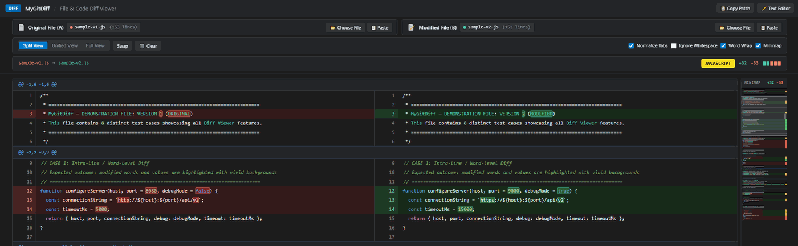
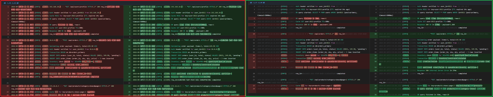
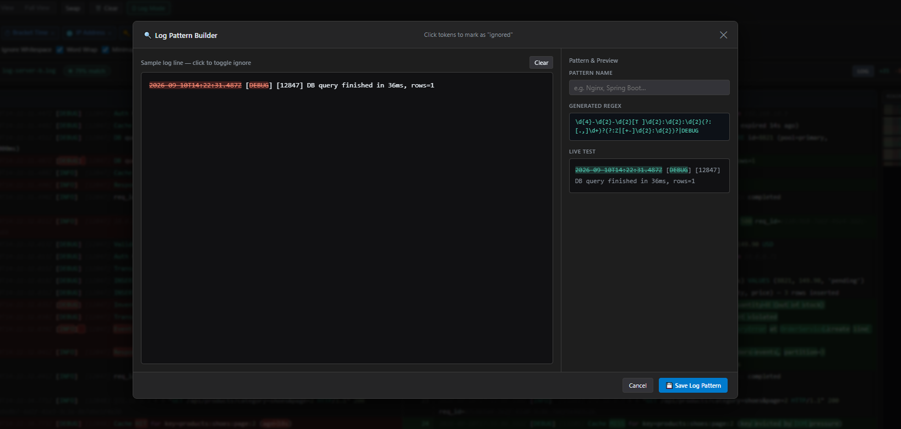
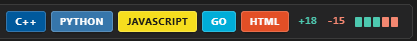

# ⚡ MyGitDiff (Diff Analyzer)

> **A blazing-fast, privacy-first, zero-dependency Git diff and Log analyzer with VS Code aesthetics — runs completely in your browser.**

[](LICENSE)
[](#)
[](#)
[](#)

<br/>



---

## 💡 Why This Project?

**MyGitDiff** was created for situations where different versions of code, files, or application logs are kept separately without a shared Git commit history. It provides an instant, privacy-first way to inspect and compare discrepancies between independent snippets — with zero setup, zero CLI dependencies, and no cloud uploads.

A major focus of this tool is **Log Analysis**: you can effortlessly compare a successful log and a failed log by simply pasting them into the browser. With **Smart Log Mode and auto-patterns**, volatile data (like timestamps or PIDs) is automatically ignored so you can spot the actual error instantly — all without ever needing to save a file, create a throwaway Git branch, or commit anything.

### 🎯 Use Cases
- **Files in `.gitignore`** — inspect files normally ignored by Git
- **Secrets & Environments** — compare `.env`, credentials, and server configs safely
- **No-Git Sources** — ZIP archives, client deliverables, standalone backups
- **Server Logs & Traces** — spot differences in long logs and stack traces
- **API Responses & Payloads** — compare JSON/YAML responses between endpoints
- **SQL Dumps & Schemas** — review database schema and migration differences
- **Ad-hoc Code Review** — instant comparison during calls without pushing branches

### ⚡ Advantages over Git Workflow
- **No Git Pollution** — no disposable branches, stash clutter, or throwaway commits
- **Scratchpad Diff** — compare directly from clipboard without creating files
- **100% Offline & Private** — zero server uploads, completely safe for confidential data

---

## ✨ Features

- 🪵 **Smart Log Mode (Automated Log Diffing)** — Compare heavy production logs without getting blinded by volatile noise on every line.
  - **Automated High-Frequency Noise Stripping**: Out of the box, MyGitDiff recognizes and strips volatile fields before diffing:
    - 📅 **ISO DateTime**: `2026-09-10T14:22:31.445Z`
    - ⏱ **Bracket Time**: `[14:22:31.445]`
    - 🌐 **IPv4 Addresses**: `192.168.10.4`
    - 🔑 **UUIDs / GUIDs**: `a3f7c2d1-9e4b-4f81-b2c8-0d5e6f7a8b9c`
    - ⚙ **Process IDs (PID)**: `[12847]`
  - **Semantic Intra-Line Highlighting**: Unlike conventional diff tools that highlight every line because timestamps never match, MyGitDiff aligns log structures, dims volatile tokens as background context (`.log-noise`), and highlights **strictly the genuine discrepancies** — HTTP status codes (`200` vs `500`), exception messages, query durations, and unexpected payload mutations.
  
  

  - **Interactive Pattern Pills**: Easily inspect, toggle, or remove noise rules on the fly with badge pills:
  
  

  - **Visual Log Pattern Builder**: Paste or drag & drop any log line directly into `CHANGE PATTERN`. Click tokens to mark them as ignored, auto-generate fine-tuned regex patterns, and preview live matches before saving custom rules:
  
  

- 🚀 **100% Client-Side & Private** — No server calls, no telemetry, no data leaks. Your source code never leaves your computer.
- 🔀 **Split, Unified & Full Views** — Switch between 2-column side-by-side split view, unified linear diff, or Full View (shows entire files with all lines and whitespace preserved).
  
  

- 🔍 **Intra-line Word Diff** — Granular character/word-level diff highlighting within modified lines.
- 📊 **Similarity Match Percentage** — Real-time content similarity score (0–100%) with dynamic status pill (`high`, `medium`, `low`) displayed right beside file names.
  
  
- 📁 **Effortless Input** — Drag & drop files onto panels, use file pickers, or paste directly from clipboard.
- ✏️ **Built-in Text Editor** — Dedicated modal editor to paste and edit code snippets directly without saving files.
- 🔄 **Swap & Clear** — Instantly swap File A and File B in one click, or clear the workspace.
- 🔤 **Whitespace & Tab Normalization** — Toggles to ignore whitespace discrepancies and normalize tab indentation.
- ↩️ **Word Wrap** — Wrap long lines cleanly to avoid horizontal scrolling.
- 🏷️ **Branded Language Badges** — Automatic language detection with official logo color pills (over 30 languages supported) and dual-language transition indicators (`C → C++`, `JS → TS`).
  
  

- 🗺️ **VS Code Style Minimap** — Authentic right-hand code overview canvas rendering full document structure, micro-code syntax coloring, real-time diff highlights (+ / -), a draggable translucent viewport slider, line hover tooltips, and click-to-scroll navigation (toggle via Alt+M).
- 📋 **Git Patch Export** — One-click copy of standard unified Git patch to clipboard.
- 🪶 **Zero-Config Single File** — Self-contained in a single lightweight `git-diff.html` file. Double-click and compare!

---

## 🖥️ Quick Start

🌐 **[Try Live Demo in Browser](https://vtllll.github.io/MyGitDiff/)** (No install needed)

### Run Locally:
1. Clone or download the repository:
   ```bash
   git clone https://github.com/Vtllll/MyGitDiff.git
   ```
2. Double-click `dist/git-diff.html` in any modern web browser (Chrome, Edge, Firefox, Safari, Brave).
3. **Try the Demo Examples** in `examples/`:
   - **Server Log Showcase (Smart Log Mode with automated timestamp & noise stripping)**:
     - `examples/log-server-a.log` & `examples/log-server-b.log`
     - *Turn on "LOG MODE" to eliminate timestamp, PID, and IP noise, revealing only genuine server failures, latency spikes, and status differences.*
   - **Feature Showcase (Comprehensive diff capabilities)**:
     - `examples/sample-v1.js` & `examples/sample-v2.js`
   - **Multi-Language Showcase (5 languages compared simultaneously with brand badges)**:
     - `examples/sample-multilang-v1.txt` & `examples/sample-multilang-v2.txt`
     - *Includes C++, Python, JavaScript, Go, and HTML all in one comparison to display all 5 color badges at once.*

---

## 🛠️ Development

If you want to customize or contribute:
- Source files are in `src/` (`index.html`, `styles.css`, `app.js`).
- Build the standalone file: `node build.js` (or `npm run build`).
- Run tests: `node test/diff.test.js` (or `npm run test`).

---

## 📄 License

This project is licensed under the [MIT License](LICENSE) — feel free to use, modify, and distribute as you wish.
